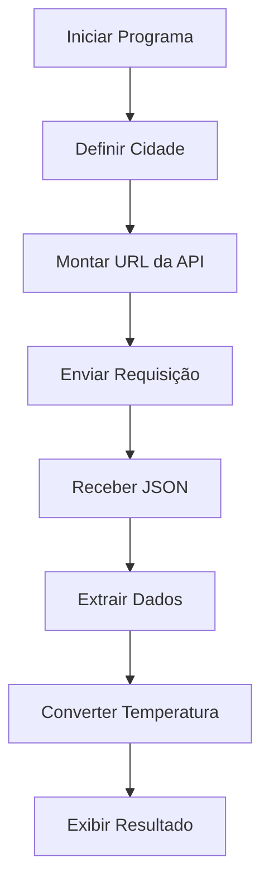

# OpenWeather-python

# 🌦️ Previsão do Tempo com Python

<div align="center">


Aplicação simples desenvolvida em Python para consulta da previsão do tempo utilizando a API OpenWeather.

</div>

---

## 📖 Sobre o Projeto

Este projeto realiza uma consulta em tempo real à API do OpenWeather para obter informações climáticas de uma cidade específica.

O sistema faz uma requisição HTTP, processa os dados retornados em formato JSON e exibe informações meteorológicas diretamente no terminal.

Projeto desenvolvido com foco em:

- Consumo de APIs REST;
- Manipulação de JSON;
- Requisições HTTP;
- Integração de serviços externos;
- Prática de Python para aplicações reais.

---

## 📸 Demonstração

### Terminal

```text
PREVISÃO DO TEMPO
 --SÃO PAULO--

Clima: céu limpo
Temperatura: 24.58ºC
```

> Adicione aqui um print da execução.

```md

```

---

## ⚙️ Funcionalidades

✅ Consulta de dados climáticos em tempo real

✅ Integração com OpenWeather API

✅ Conversão automática de Kelvin para Celsius

✅ Exibição da descrição do clima em português

✅ Saída organizada no terminal

---

## 🛠️ Tecnologias Utilizadas

| Tecnologia | Função |
|------------|---------|
| Python | Linguagem principal |
| Requests | Requisições HTTP |
| OpenWeather API | Dados meteorológicos |

---

## 📂 Estrutura do Projeto

```text
previsao-tempo/
│
├── previsao-tempo.py
├── README.md
│
└── images/
    └── previsao-tempo.png
```

---

## 🔄 Fluxo de Funcionamento



---

## 📜 Como Funciona

O programa:

1. Define a cidade desejada;
2. Constrói a URL da API OpenWeather;
3. Realiza uma requisição HTTP utilizando a biblioteca Requests;
4. Recebe os dados em formato JSON;
5. Extrai:
   - descrição do clima;
   - temperatura atual;
6. Converte a temperatura de Kelvin para Celsius;
7. Exibe as informações no terminal.

---

## 🚀 Como Executar

### 1. Clone o repositório

```bash
git clone https://github.com/FeeSz/previsao-tempo.git
```

### 2. Acesse a pasta

```bash
cd previsao-tempo
```

### 3. Instale as dependências

```bash
pip install requests
```

### 4. Execute o programa

```bash
python previsao-tempo.py
```

---

## 🔑 Configuração da API

O projeto utiliza uma chave da OpenWeather API.

Para obter sua própria chave:

1. Crie uma conta em:
   
   https://openweathermap.org/api

2. Gere sua API Key.

3. Substitua no código:

```python
API_KEY = "SUA_CHAVE_AQUI"
```

---

## 🌍 Exemplo de Personalização

Alterando a variável:

```python
cidade = "São Paulo"
```

Você pode consultar qualquer cidade suportada pela API:

```python
cidade = "Rio de Janeiro"
```

```python
cidade = "Curitiba"
```

```python
cidade = "Salvador"
```

---

## 🎯 Objetivos de Aprendizado

Este projeto foi criado para praticar:

- Consumo de APIs;
- Requisições HTTP;
- Tratamento de dados JSON;
- Manipulação de strings;
- Desenvolvimento de scripts em Python.

---

## 🚀 Melhorias Futuras

- [ ] Interface gráfica
- [ ] Consulta de múltiplas cidades
- [ ] Previsão para vários dias
- [ ] Escolha de cidade pelo usuário
- [ ] Tratamento de erros de conexão
- [ ] Exibição de umidade e velocidade do vento
- [ ] Integração com geolocalização

---

## 👨‍💻 Autor

**Felype Souza**

Estudante de Desenvolvimento de Sistemas e apaixonado por tecnologia.

🐙 GitHub: https://github.com/FeeSz

---

## 📄 Licença

Este projeto está licenciado sob a Licença MIT.

Consulte o arquivo `LICENSE` para mais informações.
